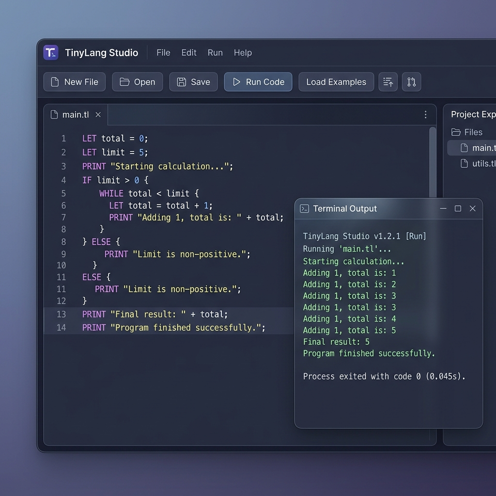

# ⚡ TinyLang Studio

> A professional, interactive playground and custom interpreter pipeline for learning programming language design.



TinyLang Studio is a professional developer dashboard and custom interpreter for **TinyLang** — a lightweight, structured programming language designed to demonstrate compiler/interpreter architecture. It features a sandbox execution pipeline (Lexer, Parser, AST, and Evaluator) built completely from scratch using Node.js, and a glassmorphic dashboard interface built using React + CSS.

---

## 🚀 Key Features

* **Custom Interpreter Pipeline**: Lexer, Parser, AST, and Evaluator built from scratch (no `eval()` or unsandboxed execution).
* **Live Line-by-Line Diagnostics**: Synchronized line-numbered editor with visual indicators on syntax and runtime errors.
* **Infinite Loop Prevention**: Smart execution ceiling to prevent browser and backend lockups.
* **Preloaded Examples**: Instant one-click loading of *Hello World*, *Variables*, *IF/ELSE*, *Loops*, and *FizzBuzz*.

---

## 🛠️ Architecture & Execution Pipeline

TinyLang processes source code through a modular, decoupled compiler pipeline:

```
[ Source Code ] 
       │
       ▼
 1. Tokenizer (Lexer)      ──►  Breaks code into Keyword, Identifier, Number, String, and Operator tokens.
       │
       ▼
 2. AST Parser             ──►  Builds an Abstract Syntax Tree using recursive descent with precedence rules.
       │
       ▼
 3. Evaluator Interpreter  ──►  Walks the AST tree and executes commands safely within a scoped Environment.
       │
       ▼
[ Console Output ]
```

### Component Structure
* **Lexer / Tokenizer** (`server/interpreter/tokenizer.js`): Maps characters to structured token objects with line metadata.
* **Parser** (`server/interpreter/parser.js`): Converts tokens into structured statements and expressions with correct precedence levels.
* **Evaluator** (`server/interpreter/evaluator.js`): Executes AST nodes recursively, hosting variables inside isolated environments.
* **Error Tracker** (`server/interpreter/errors.js`): Enforces structural rules and provides user-friendly compilation errors.

---

## 📝 Syntax Guide

### Variables
Declare variables using the `LET` keyword:
```text
LET name = "Sabhya"
LET age = 20
LET total = 10 + 5
```

### Console Logging
Print strings, variables, or expressions to the console output:
```text
PRINT "Hello World"
PRINT name
PRINT total
```

### Conditional Logic
Execute branching logic using structured `IF-THEN-ELSE-END` statements:
```text
IF age >= 18 THEN
  PRINT "Access Granted"
ELSE
  PRINT "Access Denied"
END
```

### Loops
Iterate over a sequence of numbers using `FOR-TO-END` blocks:
```text
FOR i = 1 TO 5
  PRINT i
END
```

### Comments
Write single-line notes prefixed with `#`:
```text
# This will be ignored by the tokenizer
```

---

## ⚡ Setup & Launch Instructions

Ensure you have [Node.js](https://nodejs.org/) installed.

### 1. Start the API Server (Backend)
```bash
cd server
npm install
npm start
```
*The server will start listening at `http://localhost:5000`.*

### 2. Start the Studio Dashboard (Client)
```bash
cd client
npm install
npm run dev
```
*Open `http://localhost:5173/` in your browser to start writing code.*

---

## 📂 Example Programs

| Program | TinyLang Source | Expected Output |
| :--- | :--- | :--- |
| **1. Hello World** | `PRINT "Hello World"` | `Hello World` |
| **2. Variables** | `LET a = 5`<br>`LET b = 10`<br>`PRINT a + b` | `15` |
| **3. Conditionals** | `LET x = 12`<br>`IF x % 2 == 0 THEN`<br>`  PRINT "Even"`<br>`ELSE`<br>`  PRINT "Odd"`<br>`END` | `Even` |
| **4. FizzBuzz** | `FOR i = 1 TO 15`<br>`  IF i % 15 == 0 THEN`<br>`    PRINT "FizzBuzz"`<br>`  ELSE`<br>`    IF i % 3 == 0 THEN`<br>`      PRINT "Fizz"`<br>`    ELSE`<br>`      IF i % 5 == 0 THEN`<br>`        PRINT "Buzz"`<br>`      ELSE`<br>`        PRINT i`<br>`      END`<br>`    END`<br>`  END`<br>`END` | `1`<br>`2`<br>`Fizz`<br>`4`<br>`Buzz`<br>`Fizz`<br>`7`<br>`8`<br>`Fizz`<br>`Buzz`<br>`11`<br>`Fizz`<br>`13`<br>`14`<br>`FizzBuzz` |
